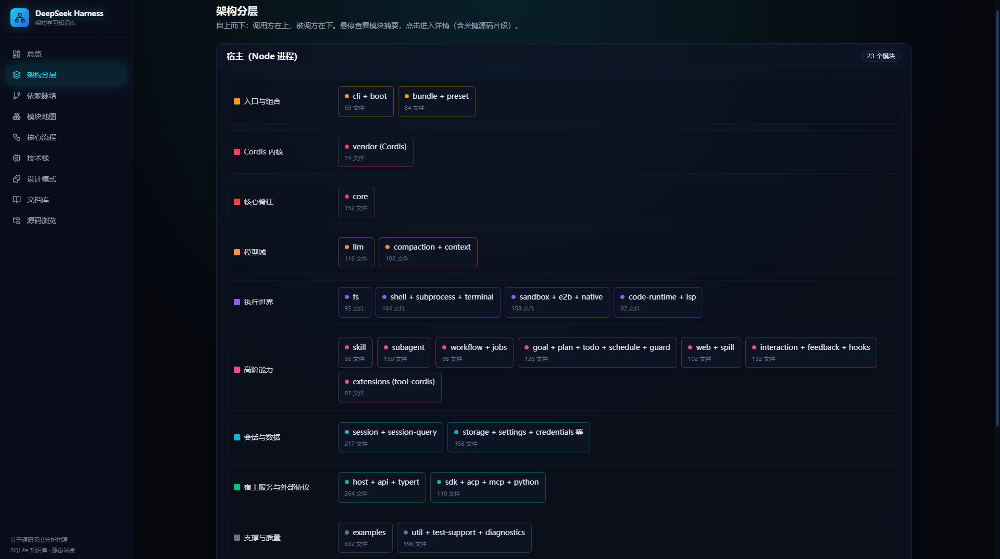
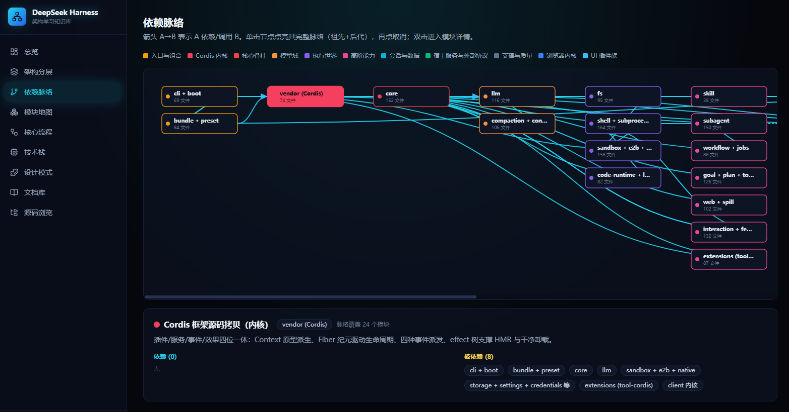
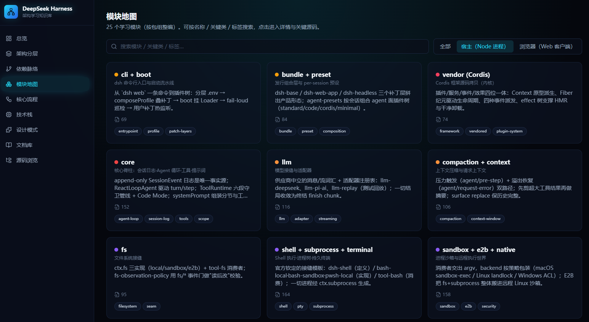
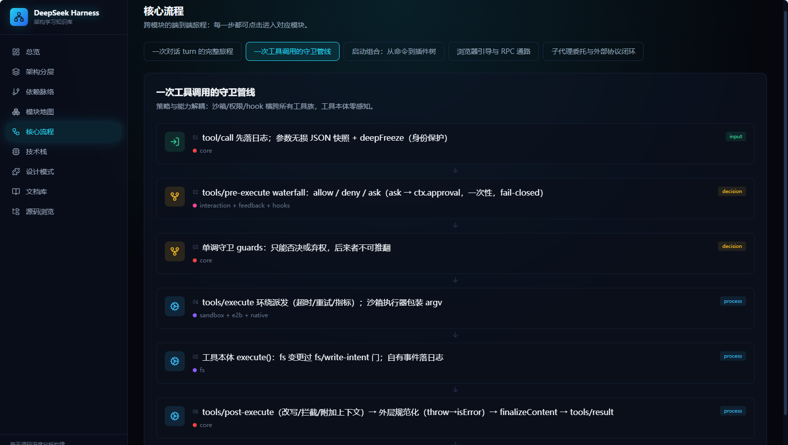
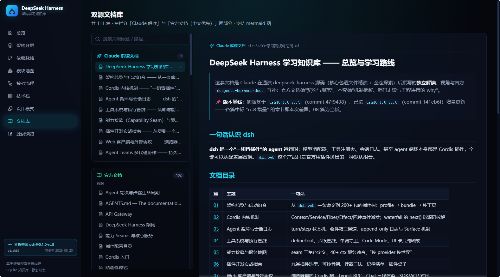

# DeepSeek Harness 架构学习知识库（可视化站点）

针对 [`deepseek-harness`](https://github.com/deepseek-ai/deepseek-harness) 仓库的交互式学习地图：架构分层、依赖脉络、核心流程、模块深读（含**关键源码片段**）、**双源文档库**（官方文档中文优先 + Claude 解读文档）、活体源码浏览。

> 本项目是第三方独立的源码分析与学习工具，与 DeepSeek 官方无隶属关系；分析基线（release + commit）见站点侧栏徽章。




| 依赖脉络（点击高亮全谱系） | 模块深读（关键源码片段） |
|---|---|
|  |  |

| 核心流程（逐步动线） | 双源文档库 |
|---|---|
|  |  |

技术栈：React + TypeScript + Tailwind + Vite；知识库先落 SQLite 再导出 JSON（构建期）。

## 快速开始

```bash
npm install
npm run dev        # predev 自动跑数据管线，然后起开发服务器（默认 5173）
npm run build      # 静态生产构建 → dist/
npm run preview    # 预览生产构建
```

## 只是 clone 本仓库来学习？零配置直接用

分析数据与全部文档**已提交进仓库**（`public/data/`、`public/docs/`、`_meta/inventory/`）——`npm install && npm run dev` 即可完整使用，**不需要**旁边有 deepseek-harness 仓库。数据管线（`scripts/data.mjs`）会自动检测：上游源码/文档目录不存在时跳过再生、直接使用提交的数据，不会误删。仅"源码浏览"页需要真实的 deepseek-harness checkout 才有内容。

当前分析基线见侧栏徽章（release + commit + 同步日期），数据由 `public/extra-stats.json` 驱动。

## 数据管线（npm run data，dev/build 前自动执行；编排器 scripts/data.mjs 按源可用性逐步守卫）

1. `scripts/gen-inventory.mjs` —— 扫描 `../deepseek-harness`，按包组生成文件清单 → `_meta/inventory/`（文件计数的唯一事实源）。**缺上游仓库时跳过。**
2. `scripts/build-knowledge-db.mjs` —— 读取 `scripts/modules-data.mjs`（学习模块、分层、关系、核心流程、源码片段），文件数从清单计算 → `public/knowledge.sqlite` + `public/data/knowledge.json`。输入全部已提交，**始终可跑**。
3. `scripts/sync-docs.mjs` —— 双源同步 Markdown → `public/docs/`：
   - `claude/` ← `../docs`（Claude 解读文档）
   - `official/` ← `../deepseek-harness/docs`（中文优先：有 `.zh.md` 就取 `.zh.md`，否则取 `.md`）
   - **任一文档源缺失时跳过**（它会先清空 public/docs 再同步，跳过是为保护已提交文档）。

## 页面

总览 · 架构分层 · 依赖脉络 · 模块地图（详情含「关键源码」标签页）· 核心流程 · 技术栈 · 设计模式 · 双源文档库（mermaid 支持）· 源码浏览（仅 dev/preview 模式：直接浏览 deepseek-harness 真实源码）。

## 更新知识库

- 模块 / 层 / 关系 / 流程 / 模式 / **源码片段**都在 `scripts/modules-data.mjs`，改完重跑 `npm run data`。
- deepseek-harness 代码更新后重跑 `npm run data` 即可刷新文件计数与文档。
- 静态 `dist/` 可部署到任意静态托管（HashRouter + 相对 base）；只有「源码浏览」页需要 dev/preview 服务器。
